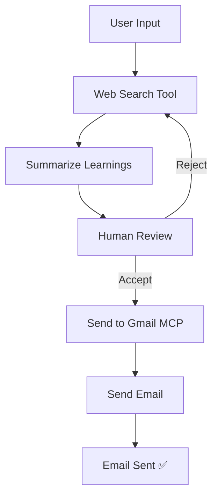

# AI Summarization Agent
This project contains approach on how to build an ReAct AI agent using LangGraph. please find the flow below

```mermaid
flowchart TD
    A[User Input] --> B[Web Search Tool]
    B --> C[Summarize Learnings]
    C --> D[Human Review]

    D -->|Reject| B
    D -->|Accept| E[Send to Gmail MCP]

    E --> F[Send Email]
    F --> G[Email Sent ✅]
```