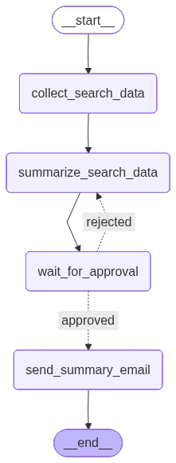

# AI Summarization Agent

### Prerequisites of the project
* copy the .env.sample file and create .env file with the values
* gmail tool setup,
  * create client auth credentials
  * run gmail_auth.py (this will generate the token.json file which will be used to send email)

### Following is the flow of the graph


### To run the project
```commandline
make run
```

