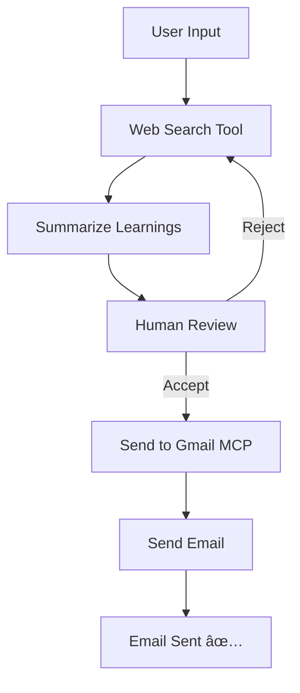

# AI Summarization Agent
This project contains approach on how to build an ReAct AI agent using LangGraph. please find the flow below


### Prerequisites of the project
* copy the .env.sample file and create .env file with the values
* gmail tool setup,
  * create client auth credentials
  * run gmail_auth.py (this will generate the token.json file which will be used to send email)

### Following if the flow of the graph


### To run the project
```commandline
make run
```

